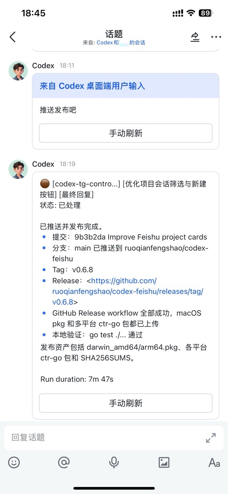
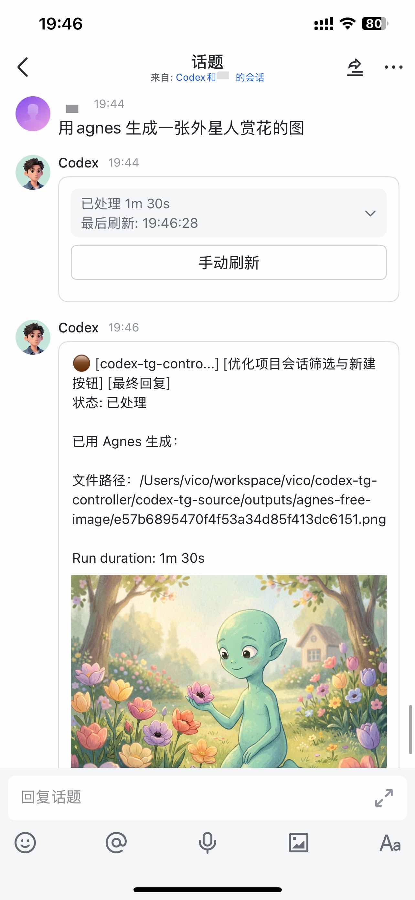
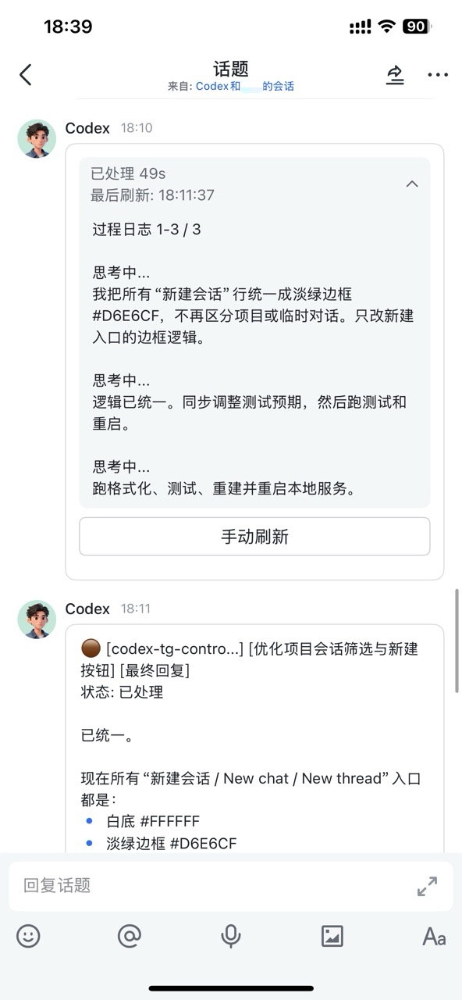
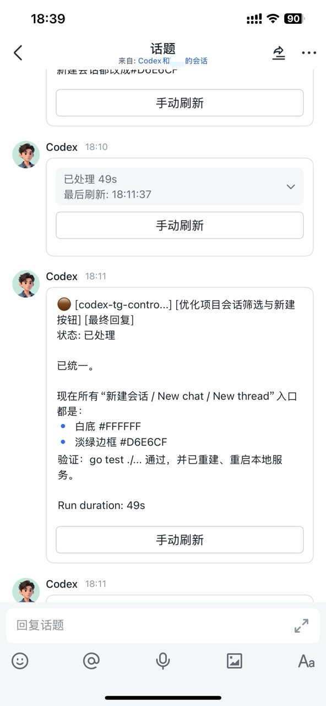
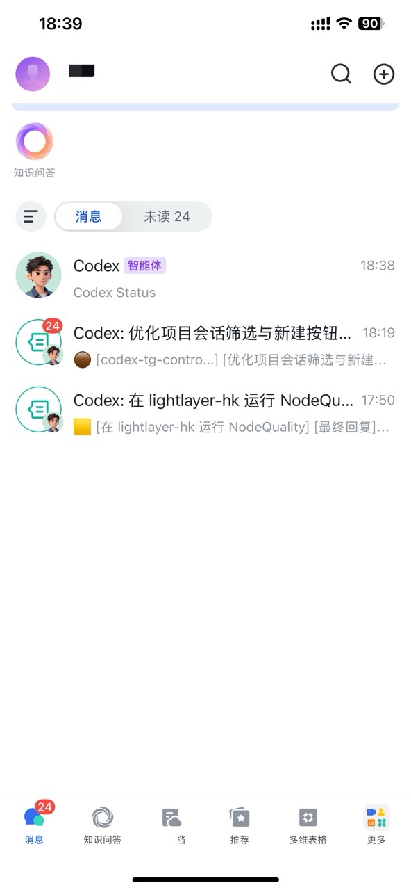
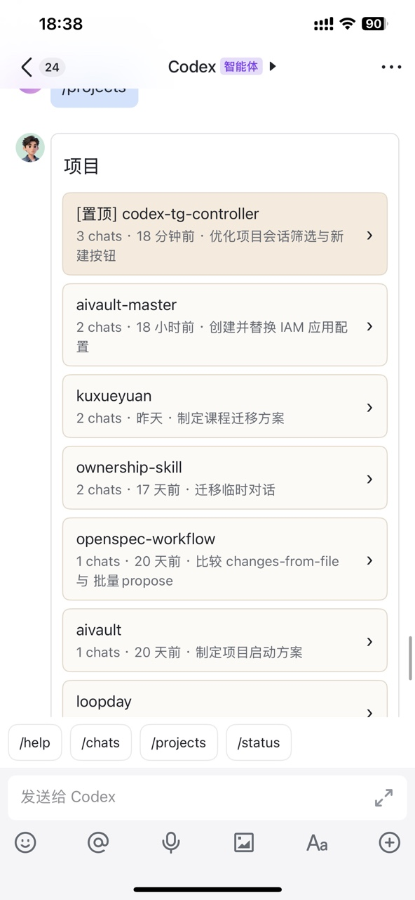
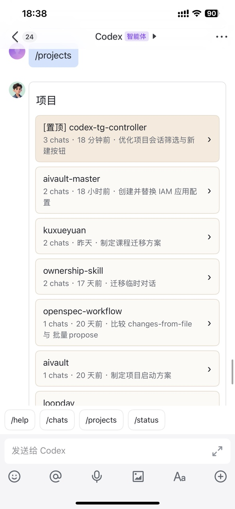

# codex-feishu：在飞书中控制本地 Codex

[English](README.md) | [简体中文](README.zh-CN.md)

`codex-feishu` 是一个本地 Go daemon，用于从飞书/Lark 远程控制
OpenAI Codex App Server。Codex 仍运行在你的机器上；本工具把已打开的
Codex thread 映射成飞书话题，并通过飞书机器人单聊处理回复、审批、进度、
最终答案、图片和项目导航。

项目名是 `codex-feishu`；当前命令行二进制仍叫 `ctr-go`。产品形态已经
只面向飞书。旧的其他渠道 adapter 和全局 observer 式监控已经移除。

本项目基于
[`mideco-tech/codex-tg`](https://github.com/mideco-tech/codex-tg)
二次开发，并针对飞书/Lark 工作流进行了大量改造，包括飞书专用 adapter、
项目/thread 导航、话题卡片、最终卡片修复、安装健康检查和本地服务默认值。

## 功能

- 通过 `ctr-go feishu setup` 创建或连接飞书/Lark 自建应用。
- 使用飞书官方 WebSocket 长连接，不需要公网回调 URL。
- 在 Codex 机器人单聊里展示会话和项目。
- 把 Codex thread 打开成机器人单聊下的飞书话题。
- 用户打开某个飞书话题后，自动同步对应 Codex thread。
- 将 Codex 桌面端/用户输入、进度、工具调用、最终答案和图片消息发送到话题。
- 将飞书话题回复和图片发送回匹配的 Codex thread。
- 支持 Plan Mode、审批、停止、steer、设置、状态和修复流程。
- 本地状态存储在 SQLite 中，默认位于 `~/.codex-feishu`。

## 飞书截图

以下截图展示飞书机器人工作台、项目导航、会话卡片、设置、状态和 Codex 话题流程：

<table>
  <tr>
    <td></td>
    <td></td>
    <td></td>
  </tr>
  <tr>
    <td></td>
    <td></td>
    <td></td>
  </tr>
  <tr>
    <td></td>
    <td></td>
    <td></td>
  </tr>
</table>

## 快速开始

前置条件：

- 已安装 OpenAI Codex CLI，并支持 `codex app-server`。
- 有权限创建或授权飞书/Lark 企业自建应用。

macOS 推荐从
[GitHub Releases](https://github.com/ruoqianfengshao/codex-feishu/releases/latest)
下载 tarball 并安装到用户 bin 目录。这个方式不需要 `sudo`：

```bash
VERSION="v0.6.4"
ARCH="$(uname -m)"
if [ "$ARCH" = "x86_64" ]; then ARCH="amd64"; fi
mkdir -p "$HOME/.local/bin"
curl -L -o /tmp/ctr-go.tar.gz \
  "https://github.com/ruoqianfengshao/codex-feishu/releases/latest/download/ctr-go_${VERSION}_darwin_${ARCH}.tar.gz"
tar -xzf /tmp/ctr-go.tar.gz -C "$HOME/.local/bin" ctr-go
"$HOME/.local/bin/ctr-go" version
```

确保 `$HOME/.local/bin` 在 `PATH` 中，或使用绝对路径调用二进制。

然后配置并启动用户 LaunchAgent：

```bash
ctr-go service install --start --start-at-login
ctr-go feishu setup
ctr-go doctor
```

服务会安装为用户 LaunchAgent，不需要 `sudo`。当前安装后的 CLI 名称仍为
`ctr-go`。

从源码运行：

```bash
git clone https://github.com/ruoqianfengshao/codex-feishu.git
cd codex-feishu
go run ./cmd/ctr-go feishu setup
go run ./cmd/ctr-go doctor
go run ./cmd/ctr-go daemon run
```

`ctr-go feishu setup` 会打印一次性配置链接和二维码。用户在飞书/Lark 中授权
后，它会把 app id 和 secret 写入本地私有配置文件。已有应用也可以通过环境变量
配置：

```bash
export CTR_GO_ADAPTER="feishu"
export CTR_GO_FEISHU_APP_ID="<feishu-app-id>"
export CTR_GO_FEISHU_APP_SECRET="<feishu-app-secret>"
export CTR_GO_FEISHU_ALLOWED_OPEN_IDS="<feishu-open-id>"
export CTR_GO_FEISHU_ALLOWED_CHAT_IDS="<feishu-chat-id>"
```

飞书应用需要启用机器人、启用 WebSocket 事件订阅、订阅消息接收事件，并启用
交互卡片回调。同时需要目标会话所需的消息、图片、文件和群组权限。如果卡片按钮、
图片或文件上传失败，先运行 `ctr-go doctor`，再检查飞书应用权限。

`ctr-go doctor` 会在 `health` 字段下输出 JSON 健康报告。AI 安装器应把
`health.ok == true` 作为就绪判断；如果为 false，应优先读取
`health.checks[].remediation` 和 `health.next_actions`，再修改配置。

## 日常使用

把 Codex 机器人单聊作为工作台：

```text
/help
/chats
/projects
/new <prompt>
/status
/setting
```

从 `/chats` 打开已有会话，或从 `/projects` 打开项目并点击 `New thread`。
daemon 会为该 Codex thread 创建或重新打开一个飞书话题。之后在这个话题中继续
对话。

`/new <prompt>` 总是创建临时 Codex 会话。项目内的新会话应从项目卡片创建。

`/help` 返回交互命令卡片。在机器人单聊中，它展示工作台命令，并说明哪些命令
需要进入 Codex 会话话题使用；在话题中，它只展示 `/plan`、`/goal`、`/stop`
等当前会话可用命令。

`/setting` 打开飞书表单，可调整模型、推理强度和机器人语言。如果本地尚未保存
覆盖值，模型和推理强度下拉会回填当前 Codex 配置。

`/status` 返回 dashboard 风格的飞书卡片，包含健康和会话 KPI，以及带百分比的
飞书会话构成饼图。语言切换只保留在 `/setting` 中，不在 `/status` 中提供。

如果你想在输入框中提供快捷入口，可以在飞书/Lark 开发者后台手动配置机器人菜单。
推荐命令：

- `/help`
- `/chats`
- `/projects`
- `/new`
- `/status`
- `/setting`
- `/repair`

## 命令

飞书机器人命令：

- `/start`
- `/help`
- `/chats [limit|search]`
- `/projects`
- `/new <prompt>`
- `/show <thread>`
- `/plan <text>`
- `/plan <thread_id> <text>`
- `/goal <goal>`
- `/goal clear`
- `/setting`
- `/status`
- `/repair`
- `/stop [thread]`
- `/approve <request_id>`
- `/deny <request_id>`

运行时命令：

```bash
ctr-go init
ctr-go feishu setup
ctr-go service install
ctr-go service start
ctr-go service stop
ctr-go service restart
ctr-go service status
ctr-go doctor
ctr-go status
ctr-go repair
ctr-go daemon run
```

二进制名称未来可能调整；在此之前，自动化应继续调用 `ctr-go`。

## 配置

常用环境变量：

- `CTR_GO_HOME` 默认 `~/.codex-feishu`
- `CTR_GO_CONFIG`
- `CTR_GO_ADAPTER` (`feishu`)
- `CTR_GO_CODEX_BIN`
- `CTR_GO_APP_SERVER_LISTEN`
- `CTR_GO_FEISHU_APP_ID`
- `CTR_GO_FEISHU_APP_SECRET`
- `CTR_GO_FEISHU_ALLOWED_OPEN_IDS`
- `CTR_GO_FEISHU_ALLOWED_CHAT_IDS`
- `CTR_GO_DEFAULT_CWD`
- `CTR_GO_CODEX_CHATS_ROOT`
- `CTR_GO_NOTIFY_SYSTEM`
- `CTR_GO_OPEN_CODEX_DESKTOP_ON_FEISHU`
- `CTR_GO_LOG_ENABLED`
- `CTR_GO_DIAGNOSTIC_LOGS`
- `CTR_GO_OBSERVER_POLL_SECONDS`
- `CTR_GO_REQUEST_TIMEOUT_SECONDS`
- `CTR_GO_PROJECTS_PROJECT_PREVIEW_LIMIT`
- `CTR_GO_PROJECTS_CHAT_PREVIEW_LIMIT`
- `CTR_GO_CHATS_PAGE_SIZE`
- `CTR_GO_INDEX_REFRESH_SECONDS`
- `CTR_GO_ATTACH_REFRESH_SECONDS`
- `CTR_GO_DELIVERY_RETRY_SECONDS`
- `CTR_GO_DELIVERY_MAX_ATTEMPTS`

在 macOS 上，如果希望飞书回复优先进入当前 Codex Desktop IPC owner 窗口，然后再
回退到 App Server，可以设置：

```bash
export CTR_GO_OPEN_CODEX_DESKTOP_ON_FEISHU=true
```

## 验证

```bash
go test ./...
go build -buildvcs=false ./...
```
